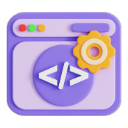

# Daily.dev Streak Keeper



A Chrome extension that automatically maintains your daily.dev streak by clicking on articles and providing timely reminders.

## 📋 Features

- **Automatic Article Clicking**: Automatically clicks on an article when you visit daily.dev (only if your streak hasn't been maintained yet today)
- **Streak Tracking**: Keeps track of your daily streak and displays it in the popup
- **Smart New Tab**: Redirects new tabs to daily.dev only when needed to maintain your streak
- **Reminder Notifications**: Sends a notification at 11:00 PM if you haven't maintained your streak yet
- **Failsafe Mechanism**: Automatically opens daily.dev and clicks an article at 11:15 PM if you haven't maintained your streak yet

## 🚀 Installation

### From Chrome Web Store (Coming Soon)

1. Visit the [Chrome Web Store](https://chrome.google.com/webstore) (link will be updated when published)
2. Click "Add to Chrome"
3. Confirm the installation

### Manual Installation (Developer Mode)

1. Download or clone this repository
2. Open Chrome and navigate to `chrome://extensions/`
3. Enable "Developer mode" in the top-right corner
4. Click "Load unpacked" and select the directory containing the extension files
5. The extension should now be installed and active

## 📱 Usage

### Automatic Streak Maintenance

The extension works automatically in the background:

1. When you open a new tab, it will redirect to daily.dev if your streak hasn't been maintained yet today
2. When you visit daily.dev, it will automatically click on an article to maintain your streak (only if needed)
3. At 11:00 PM, if you haven't maintained your streak yet, you'll receive a reminder notification
4. At 11:15 PM, if you still haven't maintained your streak, the extension will automatically open daily.dev and click on an article for you

### Popup Interface

Click on the extension icon in your browser toolbar to:

- See your current streak count
- Check if you've maintained your streak today
- Quickly access daily.dev if needed

## 🛠️ Development

### Project Structure

```
daily-dev-streaks-chrome-extension/
├── src/
│   ├── css/
│   │   └── styles.css
│   ├── html/
│   │   ├── popup.html
│   │   └── newtab.html
│   ├── js/
│   │   ├── background.js
│   │   ├── popup.js
│   │   └── newtab.js
│   └── images/
│       ├── icon16.png
│       ├── icon48.png
│       └── icon128.png
├── manifest.json
└── README.md
```

### Setup for Development

1. Clone the repository:

   ```bash
   git clone https://github.com/mayur-chavhan/daily-dev-streaks-chrome-extension.git
   cd daily-dev-streaks-chrome-extension
   ```

2. Make your changes to the code

3. Load the extension in Chrome:

   - Go to `chrome://extensions/`
   - Enable "Developer mode"
   - Click "Load unpacked" and select the extension directory

4. Test your changes

### Building for Production

1. Make sure all files are in their correct locations
2. Update version number in `manifest.json` if needed
3. Create a ZIP file of the entire directory (excluding any development files)
4. The ZIP file can be submitted to the Chrome Web Store

## 📝 License

This project is licensed under the MIT License - see the [LICENSE](LICENSE) file for details.

## ⚠️ Disclaimer

This extension is for educational purposes only. Please respect the terms of service of daily.dev and use this tool responsibly. Automating website interactions may violate the terms of service of some platforms. As of now, there is no explicit statement from daily.dev regarding the use of such automation, but users should be aware that using automation tools can potentially breach site policies.

## 🙏 Acknowledgements

- [daily.dev](https://daily.dev/) for creating an awesome platform for developers
- [Chrome Extension Documentation](https://developer.chrome.com/docs/extensions/) for providing guidance on extension development

## 📧 Contact

If you have any questions or suggestions, please open an issue on GitHub.

---

Made with ❤️ for Automation.
